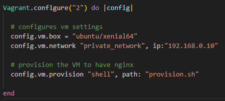
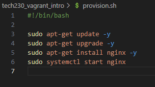
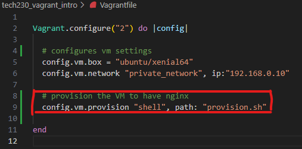
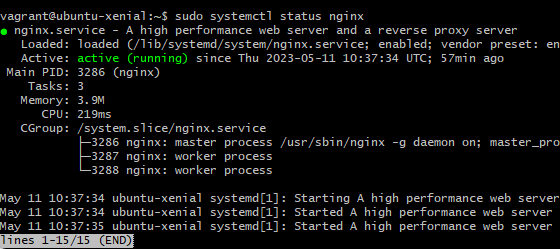

# How to deploy nginx

## A step  by step guide on deploying nginx web server and automating it's installation.

### This section shows you the automation of nginx install and start

To automate the installation of nginx web server, we will replace steps 4, 5, 6, 7 in the manual process.

1. `vagrant destroy` (This will delete any existing virtual machine and it's files within current directory)

2. `vagrant up` (creates a new virtual machine. you can check this in virtual box to make sure a new virtual machine with appropriate name is added)

3. `vagrant ssh`. This will allow you to enter the virtual machine that was just created.
NOTE: working directory in bash terminal will change to `vagrant@ubuntu/xenial64` or any other box you have configured for in Vagrantfile. This should look like this:

4. `touch provision.sh` - Run this command in the terminal to create a new file in the current directory. This file will include the shell script that is to be run when we enter our virtual machine. The script should look like this:

5. Following line is to be added to the existing configuration in Vagrantfile:

5. `sudo systemctl status nginx` - To check nginx has in fact started,  a message that looks like below will appear in bash terminal:

6. `192.168.0.10` - Nginx web server can be accessed by entering this IP address in the web browser.

7. `exit` - To exit the web server

### This section shows you how to deploy nginx manually

Before runnnig any commands, ensure you are in the correct working directory.

1. `vagrant destroy` (This will delete any existing virtual machine and it's files within current directory)

2. `vagrant up` (creates a new virtual machine. you can check this in virtual box to make sure a new virtual machine with appropriate name is added)

3. `vagrant ssh`. This will allow you to enter the virtual machine that was just created.
NOTE: working directory in bash terminal will change to `vagrant@ubuntu/xenial64` or any other box you have configured for in Vagrantfile. This should look like this:

4. `sudo apt-get update -y` - updates relevant linux packages

5. `sudo apt-get upgrade -y` - upgrades linux packages with new updates.

6. `sudo apt-get install nginx -y` - To install nginx

7. `sudo systemctl start nginx`- To start nginx web server

8. `sudo systemctl status nginx` - To check nginx has in fact started,  a message that looks like below will appear in bash terminal:

9. `192.168.0.10` - Nginx web server can be accessed by entering this IP address in the web browser.

10. `exit` - To exit the web server

