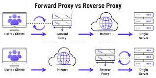

# nginx reverse proxy

## What are ports

A port is used to differentiate among different applications using the same network interface. It is an additional qualifier used by the system software to get data to the correct application.
e.g. In transfer of an audio file, file type is reocgnised by the computer through the post number.

## What is a reverse proxy? How is it different to normal proxy

A reverse proxy is a type of proxy server positioned in front of one or more origin servers, responsible for processing and forwarding requests from clients. A reverse proxy provides an additional layer of security and performance to optimize a website or web service. It is used to protect a web server's identity

Proxies process client requests and optimize the network in some way, such as enhancing security, speed, or reliability.

A forward proxy sits in front of one or more client machines, and processes both outgoing requests to and incoming responses from an external network whereas reverse proxy is positoned on the server side.

### A forward proxy server within a client-server connection:

### Difference between forward and reverse proxy:

